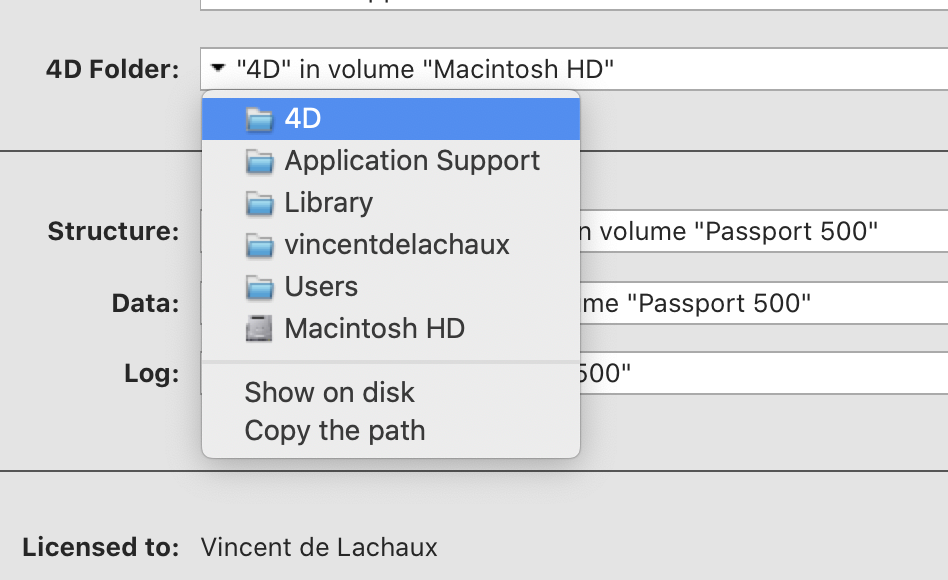
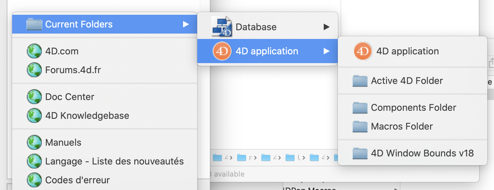

# How to locate the current 4D Folder?


## What is the 4D folder?

The 4D environment uses a specific folder to store the following information:

* Preferences files used by the 4D environment applications
* Shortcuts.xml file (custom keyboard shortcuts)
* Macros v2 folder (macro commands of Method editor)
* Favorites v1x folder, for example Favorites v13 (pathnames for local and remote databases that have been opened)
* Logs folder for maintenance logs and when the data is read-only
* The server-side cache for plugins and components

The active 4D folder is created by default at the following location:

1. **On Windows 7 and higher**: ``{Disk}:\Users\<userName>\AppData\Roaming\``
1. **On macOS**: ``{Disk}:Users:<userName>:Library:Application Support:``

Today this is true but may change in the future depending on the specifications of the operating system.

Here are the methods to simply locate the active 4D folder of the current 4D.

## Solution 1 - Manually

Open the Maintenance and Security Center (MSC) and on the Information page, click on the "4D Folder" item then select the "Show on disk" or "4D" item to open the folder.

                  

## Solution 2 - Code

This code, to be put in a utility method that you can execute whenever you want, open the active 4D folder.

```4d
SHOW ON DISK (Get 4D folder (Active 4D Folder))
```
### • v17R5+
```4d
SHOW ON DISK (Folder(fk user preferences folder).platformPath)
```

## Solution 3 - Use 4DPop Bookmarks

The <a href="https://github.com/vdelachaux/4DPop-Bookmarks">4DPop Bookmarks</a> development tool allow to directly open the used folders by the current database or the 4D Application: 4D Folder, Macros Folder, …

                  
